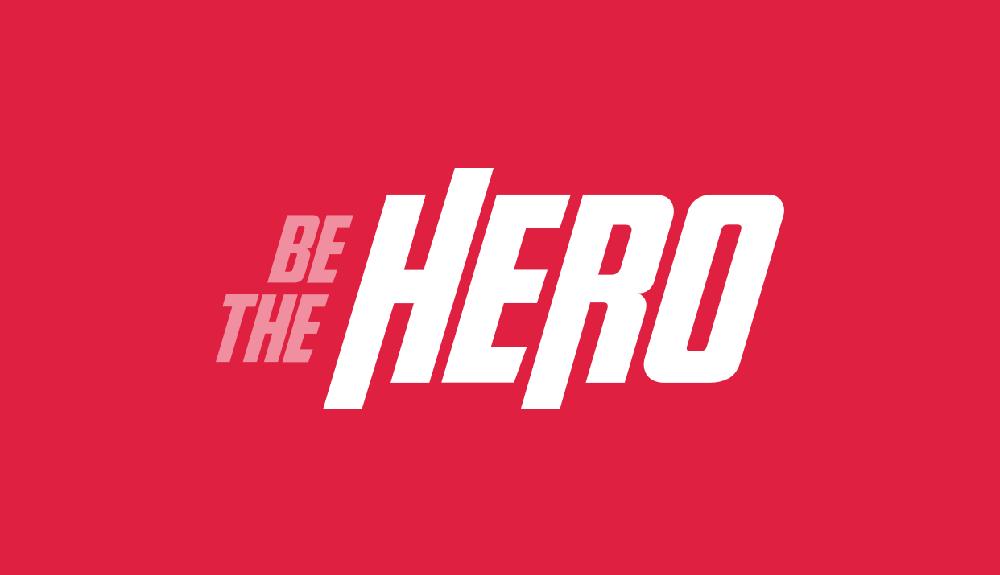

# Be The Hero

Aplicação desenvolvida durante a semana OmniStack 11

## Proposito

Oferecer um espaço onde ONGs podem descrever seus casos e qualquer pessoa que queira se tornar um herói possa contribuir

## Tecnologias

- Node.js (backend)
- ReactJS (web)
- React Native (mobile)

### Node.js

Utilizado para construir o backend seguindo as regras de uma **api rest**, em conjunto com modulos como o [kenx](https://github.com/knex/knex) para conecção com **banco de dados SLQ** e o [celebrate](https://github.com/arb/celebrate) para **validação de dados** dos usuários da api.

### ReactJS

Biblioteca usada no desenvolvimento da aplicação web, sendo um dos clientes da api, tem a função de cadastrar novas ONGs e seus respectivos casos.

### React Native

Biblioteca utilizada na construção do aplicativo mobile que consome a api com o objetivo de **listar os casos** das ONGs e facilitar o contato do usuário através do **email** ou **Whatsapp**.
